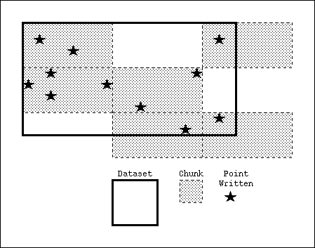
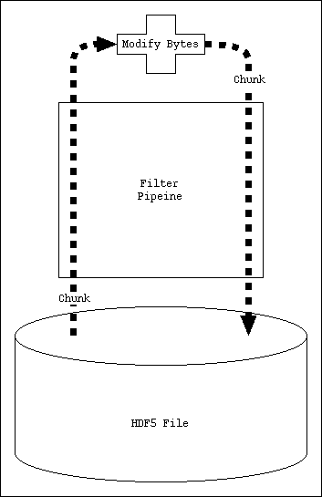
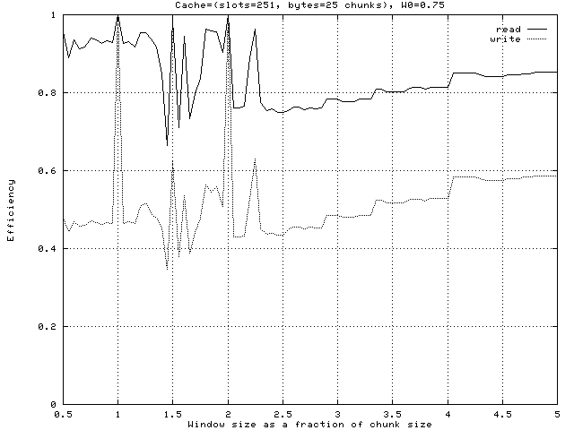
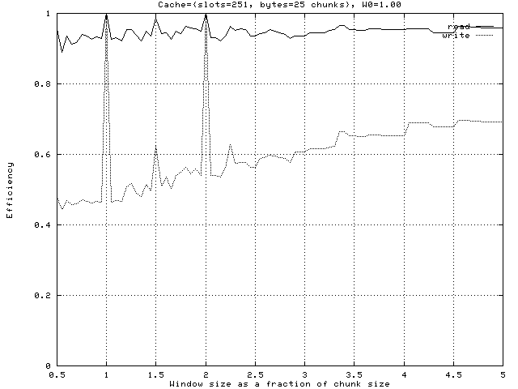
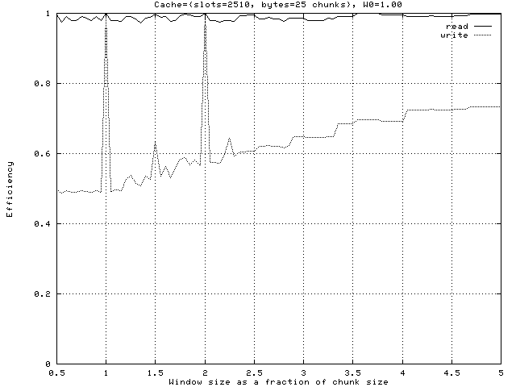
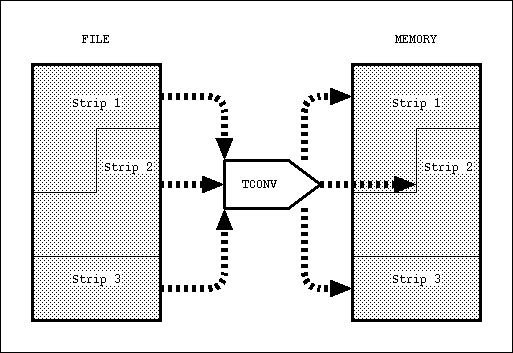

# Dataset Chunking Issues

## Introduction
_Chunking_ refers to a storage layout where a dataset is partitioned into fixed-size multi-dimensional chunks. The chunks cover the dataset but the dataset need not be an integral number of chunks. If no data is ever written to a chunk then that chunk isn't allocated on disk. Figure 1 shows a 25x48 element dataset covered by nine 10x20 chunks and 11 data points written to the dataset. No data was written to the region of the dataset covered by three of the chunks so those chunks were never allocated in the file -- the other chunks are allocated at independent locations in the file and written in their entirety.

The HDF5 library treats chunks as atomic objects -- disk I/O is always in terms of complete chunks [^1]. This allows data filters to be defined by the application to perform tasks such as compression, encryption, checksumming, etc. on entire chunks. As shown in Figure 2, if H5Dwrite() touches only a few bytes of the chunk, the entire chunk is read from the file, the data passes upward through the filter pipeline, the few bytes are modified, the data passes downward through the filter pipeline, and the entire chunk is written back to the file.

## The Raw Data Chunk Cache
It's obvious from Figure 2 that calling H5Dwrite() many times from the application would result in poor performance even if the data being written all falls within a single chunk. A raw data chunk cache layer was added between the top of the filter stack and the bottom of the byte modification layer[^2]. By default, the chunk cache will store 521 chunks or 1MB of data (whichever is less) but these values can be modified with H5Pset_cache().

The preemption policy for the cache favors certain chunks and tries not to preempt them.

Chunks that have been accessed frequently in the near past are favored.
A chunk which has just entered the cache is favored.
A chunk which has been completely read or completely written but not partially read or written is penalized according to some application specified weighting between zero and one.
A chunk which is larger than the maximum cache size is not eligible for caching.
## Cache Efficiency
Now for some real numbers... A 2000x2000 element dataset is created and covered by a 20x20 array of chunks (each chunk is 100x100 elements). The raw data cache is adjusted to hold at most 25 chunks by setting the maximum number of bytes to 25 times the chunk size in bytes. Then the application creates a square, two-dimensional memory buffer and uses it as a window into the dataset, first reading and then rewriting in row-major order by moving the window across the dataset (the read and write tests both start with a cold cache).

The measure of efficiency in Figure 3 is the number of bytes requested by the application divided by the number of bytes transferred from the file. There are at least a couple ways to get an estimate of the cache performance: one way is to turn on cache debugging and look at the number of cache misses. A more accurate and specific way is to register a data filter whose sole purpose is to count the number of bytes that pass through it (that's the method used below).

The read efficiency is less than one for two reasons: collisions in the cache are handled by preempting one of the colliding chunks, and the preemption algorithm occasionally preempts a chunk which hasn't been referenced for a long time but is about to be referenced in the near future.

The write test results in lower efficiency for most window sizes because HDF5 is unaware that the application is about to overwrite the entire dataset and must read in most chunks before modifying parts of them.

There is a simple way to improve efficiency for this example. It turns out that any chunk that has been completely read or written is a good candidate for preemption. If we increase the penalty for such chunks from the default 0.75 to the maximum 1.00 then efficiency improves.

The read efficiency is still less than one because of collisions in the cache. The number of collisions can often be reduced by increasing the number of slots in the cache. Figure 5 shows what happens when the maximum number of slots is increased by an order of magnitude from the default (this change has no major effect on memory used by the test since the byte limit was not increased for the cache).

Although the application eventually overwrites every chunk completely the library has know way of knowing this before hand since most calls to H5Dwrite() modify only a portion of any given chunk. Therefore, the first modification of a chunk will cause the chunk to be read from disk into the chunk buffer through the filter pipeline. Eventually HDF5 might contain a data set transfer property that can turn off this read operation resulting in write efficiency which is equal to read efficiency.

## Fragmentation
Even if the application transfers the entire dataset contents with a single call to H5Dread() or H5Dwrite() it's possible the request will be broken into smaller, more manageable pieces by the library. This is almost certainly true if the data transfer includes a type conversion.

By default the strip size is 1MB but it can be changed by calling H5Pset_buffer().

## File Storage Overhead
The chunks of the dataset are allocated at independent locations throughout the HDF5 file and a B-tree maps chunk N-dimensional addresses to file addresses. The more chunks that are allocated for a dataset the larger the B-tree. Large B-trees have two disadvantages:

The file storage overhead is higher and more disk I/O is required to traverse the tree from root to leaves.
The increased number of B-tree nodes will result in higher contention for the meta data cache.
There are three ways to reduce the number of B-tree nodes. The obvious way is to reduce the number of chunks by choosing a larger chunk size (doubling the chunk size will cut the number of B-tree nodes in half). Another method is to adjust the split ratios for the B-tree by calling H5Pset_btree_ratios(), but this method typically results in only a slight improvement over the default settings. Finally, the out-degree of each node can be increased by calling H5Pset_istore_k() (increasing the out degree actually increases file overhead while decreasing the number of nodes).

## Chunk Compression
Dataset chunks can be compressed through the use of filters. See the chapter “Filters in HDF5.”

Reading and rewriting compressed chunked data can result in holes in an HDF5 file. In time, enough such holes can increase the file size enough to impair application or library performance when working with that file. See “Freespace Management” in the chapter “Performance Analysis and Issues.”

Footnote [^1]: Parallel versions of the library can access individual bytes of a chunk when the underlying file uses MPI-IO.

Footnote [^2]: The raw data chunk cache was added before the second alpha release.
