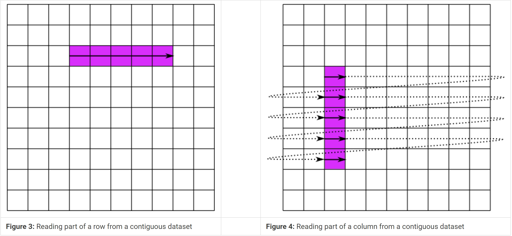
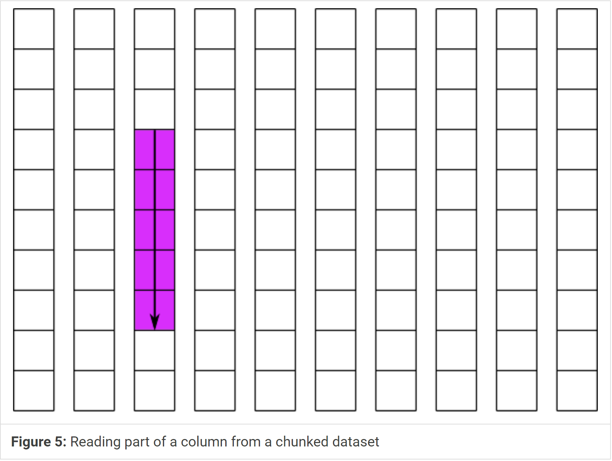
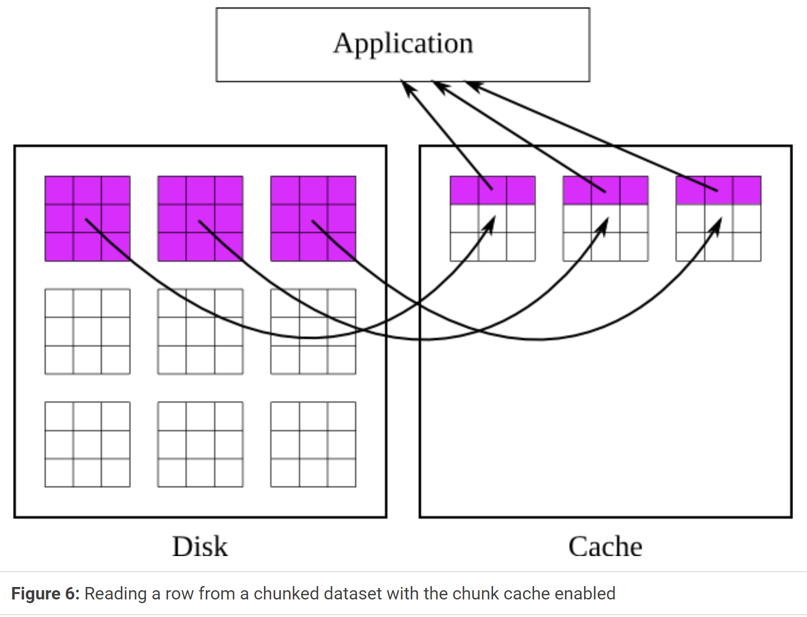
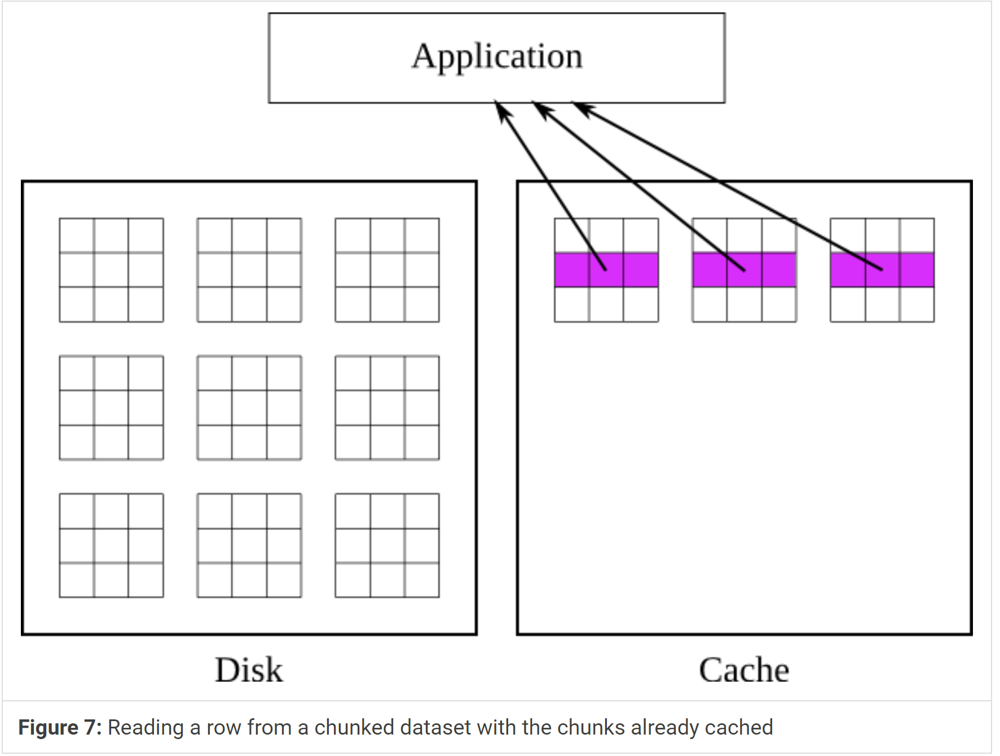
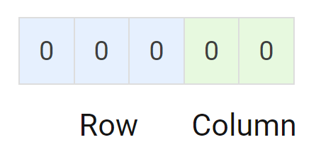

# Chunking in HDF5

## Introduction

Datasets in HDF5 not only provide a convenient, structured, and self-describing way to store data, but are also designed to do so with good performance. In order to maximize performance, the HDF5 library provides ways to specify how the data is stored on disk, how it is accessed, and how it should be held in memory.

## What are Chunks?
Datasets in HDF5 can represent arrays with any number of dimensions (up to 32). However, in the file this dataset must be stored as part of the 1-dimensional stream of data that is the low-level file. The way in which the multidimensional dataset is mapped to the serial file is called the layout. The most obvious way to accomplish this is to simply flatten the dataset in a way similar to how arrays are stored in memory, serializing the entire dataset into a monolithic block on disk, which maps directly to a memory buffer the size of the dataset. This is called a contiguous layout.

An alternative to the contiguous layout is the chunked layout. Whereas contiguous datasets are stored in a single block in the file, chunked datasets are split into multiple chunks which are all stored separately in the file. The chunks can be stored in any order and any position within the HDF5 file. Chunks can then be read and written individually, improving performance when operating on a subset of the dataset.

The API functions used to read and write chunked datasets are exactly the same functions used to read and write contiguous datasets. The only difference is a single call to set up the layout on a property list before the dataset is created. In this way, a program can switch between using chunked and contiguous datasets by simply altering that call. Example 1, below, creates a dataset with a size of 12x12 and a chunk size of 4x4. The example could be changed to create a contiguous dataset instead by simply commenting out the call to H5Pset\_chunk and changing dcpl\_id in the H5Dcreate call to H5P\_DEFAULT.

Example 1: Creating a chunked dataset

~~~
#include  "hdf5.h"
#define FILENAME "file.h5"
#define DATASET "dataset"

int main() {

    hid_t   file_id, dset_id, space_id, dcpl_id;
    hsize_t chunk_dims[2] = {4, 4};
    hsize_t dset_dims[2] = {12, 12};
    herr_t  status;
    int     i, j;
    int     buffer[12][12];

    /* Create the file */
    file_id = H5Fcreate(FILENAME, H5F_ACC_TRUNC, H5P_DEFAULT, H5P_DEFAULT);

    /* Create a dataset creation property list and set it to use chunking */
    dcpl_id = H5Pcreate(H5P_DATASET_CREATE);
    status = H5Pset_chunk(dcpl_id, 2, chunk_dims);

    /* Create the dataspace and the chunked dataset */
    space_id = H5Screate_simple(2, dset_dims, NULL);
    dset_id = H5Dcreate(file_id, DATASET, H5T_STD_I32BE, space_id, H5P_DEFAULT, dcpl_id,  H5P_DEFAULT);

    /* Initialize dataset */
     for (i = 0; i < 12; i++)
      for (j = 0; j < 12; j++)
         buffer[i][j] = i  + j + 1;

    /* Write to the dataset */
    status = H5Dwrite(dset_id, H5T_NATIVE_INT, H5S_ALL, H5S_ALL, H5P_DEFAULT, buffer);

    /* Close */
    status = H5Dclose(dset_id);
    status = H5Sclose(space_id);
    status = H5Pclose(dcpl_id);
    status = H5Fclose(file_id);
}
~~~

The chunks of a chunked dataset are split along logical boundaries in the dataset's representation as an array, not along boundaries in the serialized form. Suppose a dataset has a chunk size of 2x2. In this case, the first chunk would go from (0,0) to (2,2), the second from (0,2) to (2,4), and so on. By selecting the chunk size carefully, it is possible to fine tune I/O to maximize performance for any access pattern. Chunking is also required to use advanced features such as compression and dataset resizing.

{: height=550}

## Data Storage Order
To understand the effects of chunking on I/O performance it is necessary to understand the order in which data is actually stored on disk. When using the C interface, data elements are stored in "row-major" order, meaning that, for a 2- dimensional dataset, rows of data are stored in-order on the disk. This is equivalent to the storage order of C arrays in memory.

Suppose we have a 10x10 contiguous dataset B. The first element stored on disk is B[0][0], the second B[0][1], the eleventh B[1][0], and so on. If we want to read the elements from B[2][3] to B[2][7], we have to read the elements in the 24th, 25th, 26th, 27th, and 28th positions. Since all of these positions are contiguous, or next to each other, this can be done in a single read operation: read 5 elements starting at the 24th position. This operation is illustrated in figure 3: the pink cells represent elements to be read and the solid line represents a read operation. Now suppose we want to read the elements in the column from B[3][2] to B[7][2]. In this case we must read the elements in the 33rd, 43rd, 53rd, 63rd, and 73rd positions. Since these positions are not contiguous, this must be done in 5 separate read operations. This operation is illustrated in figure 4: the solid lines again represent read operations, and the dotted lines represent seek operations. An alternative would be to perform a single large read operation , in this case 41 elements starting at the 33rd position. This is called a sieve buffer and is supported by HDF5 for contiguous datasets, but not for chunked datasets. By setting the chunk sizes correctly, it is possible to greatly exceed the performance of the sieve buffer scheme.

 
{: height=550}

Likewise, in higher dimensions, the last dimension specified is the fastest changing on disk. So if we have a four dimensional dataset A, then the first element on disk would be A[0][0][0][0], the second A[0][0][0][1], the third A[0][0][0][2], and so on.

## Chunking and Partial I/O
The issues outlined above regarding data storage order help to illustrate one of the major benefits of dataset chunking, its ability to improve the performance of partial I/O. Partial I/O is an I/O operation (read or write) which operates on only one part of the dataset. To maximize the performance of partial I/O, the data elements selected for I/O must be contiguous on disk. As we saw above, with a contiguous dataset, this means that the selection must always equal the extent in all but the slowest changing dimension, unless the selection in the slowest changing dimension is a single element. With a 2-d dataset in C, this means that the selection must be as wide as the entire dataset unless only a single row is selected. With a 3-d dataset, this means that the selection must be as wide and as deep as the entire dataset, unless only a single row is selected, in which case it must still be as deep as the entire dataset, unless only a single column is also selected.

Chunking allows the user to modify the conditions for maximum performance by changing the regions in the dataset which are contiguous. For example, reading a 20x20 selection in a contiguous dataset with a width greater than 20 would require 20 separate and non-contiguous read operations. If the same operation were performed on a dataset that was created with a chunk size of 20x20, the operation would require only a single read operation. In general, if your selections are always the same size (or multiples of the same size), and start at multiples of that size, then the chunk size should be set to the selection size, or an integer divisor of it. This recommendation is subject to the guidelines in the pitfalls section; specifically, it should not be too small or too large.

Using this strategy, we can greatly improve the performance of the operation shown in figure 4. If we create the dataset with a chunk size of 10x1, each column of the dataset will be stored separately and contiguously. The read of a partial column can then be done is a single operation. This is illustrated in figure 5, and the code to implement a similar operation is shown in example 2. For simplicity, example 2 implements writing to this dataset instead of reading from it.

{: height=400}

Example 2: Writing part of a column to a chunked dataset

~~~
#include "hdf5.h"
#define FILENAME "file.h5"
#define DATASET  "dataset"

int main() {

    hid\_t   file\_id, dset\_id, fspace\_id, mspace\_id, dcpl\_id;
    hsize\_t chunk\_dims[2] = {10, 1};
    hsize\_t dset\_dims[2] = {10, 10};
    hsize\_t mem\_dims[1] = {5};
    hsize\_t start[2] = {3, 2};
    hsize\_t count[2] = {5, 1};
    herr\_t  status;
    int     buffer[5], i;
 
    /* Create the file */
    file\_id = H5Fcreate(FILENAME, H5F\_ACC\_TRUNC, H5P\_DEFAULT, H5P\_DEFAULT);

    /* Create a dataset creation property list to use chunking with a chunk size of 10x1 */
    dcpl\_id = H5Pcreate(H5P\_DATASET\_CREATE);

    status = H5Pset\_chunk(dcpl\_id, 2, chunk\_dims);

    /* Create the dataspace and the chunked dataset */
    fspace\_id = H5Screate\_simple(2, dset\_dims, NULL);

    dset\_id = H5Dcreate(file\_id, DATASET, H5T\_STD\_I32BE, fspace\_id, H5P\_DEFAULT, dcpl\_id, H5P\_DEFAULT);

    /* Select the elements from 3, 2 to 7, 2 */
    status = H5Sselect\_hyperslab(fspace\_id, H5S\_SELECT\_SET, start, NULL, count, NULL);

    /* Create the memory dataspace */
    mspace\_id = H5Screate\_simple(1, mem\_dims, NULL);

    /* Initialize dataset */
    for (i = 0; i < 5; i++)
        buffer[i] = i+1;

    /* Write to the dataset */
    status = H5Dwrite(dset\_id, H5T\_NATIVE\_INT, mspace\_id, fspace\_id, H5P\_DEFAULT, buffer);

    /* Close */
    status = H5Dclose(dset\_id);
    status = H5Sclose(fspace\_id);
    status = H5Sclose(mspace\_id);
    status = H5Pclose(dcpl\_id);
    status = H5Fclose(file\_id);
}
~~~

## Chunk Caching
Another major feature of the dataset chunking scheme is the chunk cache. As it sounds, this is a cache of the chunks in the dataset. This cache can greatly improve performance whenever the same chunks are read from or written to multiple times, by preventing the library from having to read from and write to disk multiple times. However, the current implementation of the chunk cache does not adjust its parameters automatically, and therefore the parameters must be adjusted manually to achieve optimal performance. In some rare cases it may be best to completely disable the chunk caching scheme. Each open dataset has its own chunk cache, which is separate from the caches for all other open datasets.

When a selection is read from a chunked dataset, the chunks containing the selection are first read into the cache, and then the selected parts of those chunks are copied into the user's buffer. The cached chunks stay in the cache until they are evicted, which typically occurs because more space is needed in the cache for new chunks, but they can also be evicted if hash values collide (more on this later). Once the chunk is evicted it is written to disk if necessary and freed from memory.

This process is illustrated in figures 6 and 7. In figure 6, the application requests a row of values, and the library responds by bringing the chunks containing that row into cache, and retrieving the values from cache. In figure 7, the application requests a different row that is covered by the same chunks, and the library retrieves the values directly from cache without touching the disk.

{: height=400}

{: height=400}

In order to allow the chunks to be looked up quickly in cache, each chunk is assigned a unique hash value that is used to look up the chunk. The cache contains a simple array of pointers to chunks, which is called a hash table. A chunk's hash value is simply the index into the hash table of the pointer to that chunk. While the pointer at this location might instead point to a different chunk or to nothing at all, no other locations in the hash table can contain a pointer to the chunk in question. Therefore, the library only has to check this one location in the hash table to tell if a chunk is in cache or not. This also means that if two or more chunks share the same hash value, then only one of those chunks can be in the cache at the same time. When a chunk is brought into cache and another chunk with the same hash value is already in cache, the second chunk must be evicted first. Therefore it is very important to make sure that the size of the hash table, also called the nslots parameter in H5Pset\_cache and H5Pset\_chunk\_cache, is large enough to minimize the number of hash value collisions.

Prior to 1.10, the library determines the hash value for a chunk by assigning a unique index that is a linear index into a hypothetical array of chunks. That is, the upper-left chunk has an index of 0, the one to the right of that has an index of 1, and so on.

For example, the algorithm prior to 1.10 simply incremented the index by one along the fastest growing dimension. The diagram below illustrates the indices for a 5 x 3 chunk prior to HDF5 1.10:

<pre>
0   1   2 
3   4   5 
6   7   8 
9   10  11 
12  13  14 
</pre>

As of HDF5 1.10, the library uses a more complicated way to determine the chunk index. Each dimension gets a fixed number of bits for the number of chunks in that dimension. When creating the dataset, the library first determines the number of bits needed to encode the number of chunks in each dimension individually by using the log2 function. It then partitions the chunk index into bitfields, one for each dimension, where the size of each bitfield is as computed above. The fastest changing dimension is the least significant bit. To compute the chunk index for an individual chunk, for each dimension, the coordinates of that chunk in an array of chunks is placed into the corresponding bitfield. The 5 x 3 chunk example above needs 5 bits for its indices (as shown below, the 3 bits in blue are for the row, and the 2 bits in green are for the column):

{: height=50}

Therefore, the indices for the 5 x 3 chunks become like this:

<pre>
0   1   2 
4   5   6 
8   9   10 
12  13  14 
16  17  18 
</pre>

This index is then divided by the size of the hash table, nslots, and the remainder, or modulus, is the hash value. Because this scheme can result in regularly spaced indices being used frequently, it is important that nslots be a prime number to minimize the chance of collisions. In general, nslots should probably be set to a number approximately 100 times the number of chunks that can fit in nbytes bytes, unless memory is extremely limited. There is of course no advantage in setting nslots to a number larger than the total number of chunks in the dataset.

The w0 parameter affects how the library decides which chunk to evict when it needs room in the cache. If w0 is set to 0, then the library will always evict the least recently used chunk in cache. If w0 is set to 1, the library will always evict the least recently used chunk which has been fully read or written, and if none have been fully read or written, it will evict the least recently used chunk. If w0 is between 0 and 1, the behavior will be a blend of the two. Therefore, if the application will access the same data more than once, w0 should be set closer to 0, and if the application does not, w0 should be set closer to 1.

It is important to remember that chunk caching will only give a benefit when reading or writing the same chunk more than once. If, for example, an application is reading an entire dataset, with only whole chunks selected for each operation, then chunk caching will not help performance, and it may be preferable to completely disable the chunk cache in order to save memory. It may also be advantageous to disable the chunk cache when writing small amounts to many different chunks, if memory is not large enough to hold all those chunks in cache at once.

## I/O Filters and Compression

Dataset chunking also enables the use of I/O filters, including compression. The filters are applied to each chunk individually, and the entire chunk is processed at once. The filter must be applied every time the chunk is loaded into cache, and every time the chunk is flushed to disk. These facts all make choosing the proper settings for the chunk cache and chunk size even more critical for the performance of filtered datasets.

Because the entire chunk must be filtered every time disk I/O occurs, it is no longer a viable option to disable the chunk cache when writing small amounts of data to many different chunks. To achieve acceptable performance, it is critical to minimize the chance that a chunk will be flushed from cache before it is completely read or written. This can be done by increasing the size of the chunk cache, adjusting the size of the chunks, or adjusting I/O patterns.

## Chunk Maximum Limits

Chunks have some maximum limits. They are:

* The maximum number of elements in a chunk is 232-1 which is equal to 4,294,967,295.
* The maximum size for any chunk is 4GB.
* The size of a chunk cannot exceed the size of a fixed-size dataset. For example, a dataset consisting of a 5x4 fixed-size array cannot be defined with 10x10 chunks.

For more information, see the entry for H5P\_SET\_CHUNK in the HDF5 Reference Manual.

## Pitfalls

Inappropriate chunk size and cache settings can dramatically reduce performance. There are a number of ways this can happen. Some of the more common issues include:

* Chunks are too small
There is a certain amount of overhead associated with finding chunks. When chunks are made smaller, there are more of them in the dataset. When performing I/O on a dataset, if there are many chunks in the selection, it will take extra time to look up each chunk. In addition, since the chunks are stored independently, more chunks results in more I/O operations, further compounding the issue. The extra metadata needed to locate the chunks also causes the file size to increase as chunks are made smaller. Making chunks larger results in fewer chunk lookups, smaller file size, and fewer I/O operations in most cases.

* Chunks are too large
It may be tempting to simply set the chunk size to be the same as the dataset size in order to enable compression on a contiguous dataset. However, this can have unintended consequences. Because the entire chunk must be read from disk and decompressed before performing any operations, this will impose a great performance penalty when operating on a small subset of the dataset if the cache is not large enough to hold the one-chunk dataset. In addition, if the dataset is large enough, since the entire chunk must be held in memory while compressing and decompressing, the operation could cause the operating system to page memory to disk, slowing down the entire system.

* Cache is not big enough
Similarly, if the chunk cache is not set to a large enough size for the chunk size and access pattern, poor performance will result. In general, the chunk cache should be large enough to fit all of the chunks that contain part of a hyperslab selection used to read or write. When the chunk cache is not large enough, all of the chunks in the selection will be read into cache, written to disk (if writing), and evicted. If the application then revisits the same chunks, they will have to be read and possibly written again, whereas if the cache were large enough they would only have to be read (and possibly written) once. However, if selections for I/O always coincide with chunk boundaries, this does not matter as much, as there is no wasted I/O and the application is unlikely to revisit the same chunks soon after.

If the total size of the chunks involved in a selection is too big to practically fit into memory, and neither the chunk nor the selection can be resized or reshaped, it may be better to disable the chunk cache. Whether this is better depends on the storage order of the selected elements. It will also make little difference if the dataset is filtered, as entire chunks must be brought into memory anyways in that case. When the chunk cache is disabled and there are no filters, all I/O is done directly to and from the disk. If the selection is mostly along the fastest changing dimension (i.e. rows), then the data will be more contiguous on disk, and direct I/O will be more efficient than reading entire chunks, and hence the cache should be disabled. If however the selection is mostly along the slowest changing dimension (columns), then the data will not be contiguous on disk, and direct I/O will involve a large number of small operations, and it will probably be more efficient to just operate on the entire chunk, therefore the cache should be set large enough to hold at least 1 chunk. To disable the chunk cache, either nbytes or nslots should be set to 0.

* Improper hash table size
Because only one chunk can be present in each slot of the hash table, it is possible for an improperly set hash table size (nslots) to severely impact performance. For example, if there are 100 columns of chunks in a dataset, and the hash table size is set to 100, then all the chunks in each row will have the same hash value. Attempting to access a row of elements will result in each chunk being brought into cache and then evicted to allow the next one to occupy its slot in the hash table, even if the chunk cache is large enough, in terms of nbytes, to hold all of them. Similar situations can arise when nslots is a factor or multiple of the number of rows of chunks, or equivalent situations in higher dimensions.

Luckily, because each slot in the hash table only occupies the size of the pointer for the system, usually 4 or 8 bytes, there is little reason to keep nslots small. Again, a general rule is that nslots should be set to a prime number at least 100 times the number of chunks that can fit in nbytes, or simply set to the number of chunks in the dataset.

## Additional Resources

The slide set [HDF5 Advanced Topics: Chunking in HDF5 (PDF)](Chunking_Tutorial_EOS13_2009.pdf), a tutorial from HDF and HDF-EOS Workshop XIII (2009) provides additional HDF5 chunking use cases and examples.

The page [HDF5 Examples](https://docs.hdfgroup.org/hdf5/develop/_h_d_f5_examples.html) lists many code examples that are regularly tested with the HDF5 library. Several illustrate the use of chunking in HDF5, particularly [Read/Write Chunked Dataset](https://docs.hdfgroup.org/hdf5/develop/_ex_a_p_i.html) and any examples demonstrating filters.

[Dataset Chunking Issues](DSChunkingIssues.md) provides additional information regarding chunking that has not yet been incorporated into this document.

## Directions for Future Development
As seen above, the HDF5 chunk cache currently requires careful control of the parameters in order to achieve optimal performance. In the future, we plan to improve the chunk cache to be more foolproof in many ways, and deliver acceptable performance in most cases even when no thought is given to the chunking parameters.

One way to make the chunk cache more user-friendly is to automatically resize the chunk cache as needed for each operation. The cache should be able to detect when the cache should be skipped or when it needs to be enlarged based on the pattern of I/O operations. At a minimum, it should be able to detect when the cache would severely hurt performance for a single operation and disable the cache for that operation. This would of course be optional.

Another way is to allow chaining of entries in the hash table. This would make the hash table size much less of an issue, as chunks could share the same hash value by making a linked list.

Finally, it may even be desirable to set some reasonable default chunk size based on the dataset size and possibly some other information on the intended access pattern. This would probably be a high-level routine.

Other features planned for chunking include new index methods (besides b-trees), disabling filters for chunks that are partially over the edge of a dataset, only storing the used portions of these edge chunks, and allowing multiple reader processes to read the same dataset as a single writer process writes to it.

