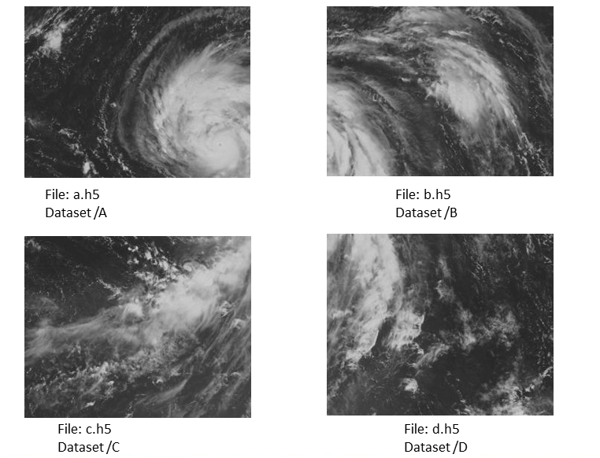
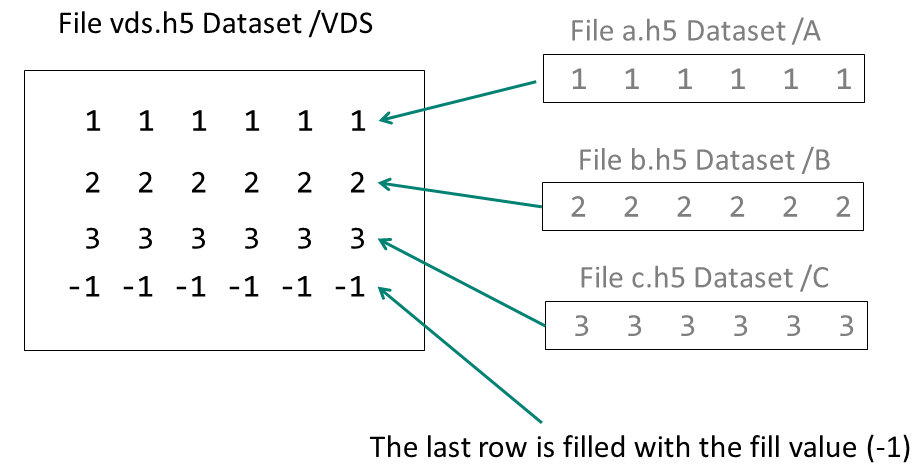
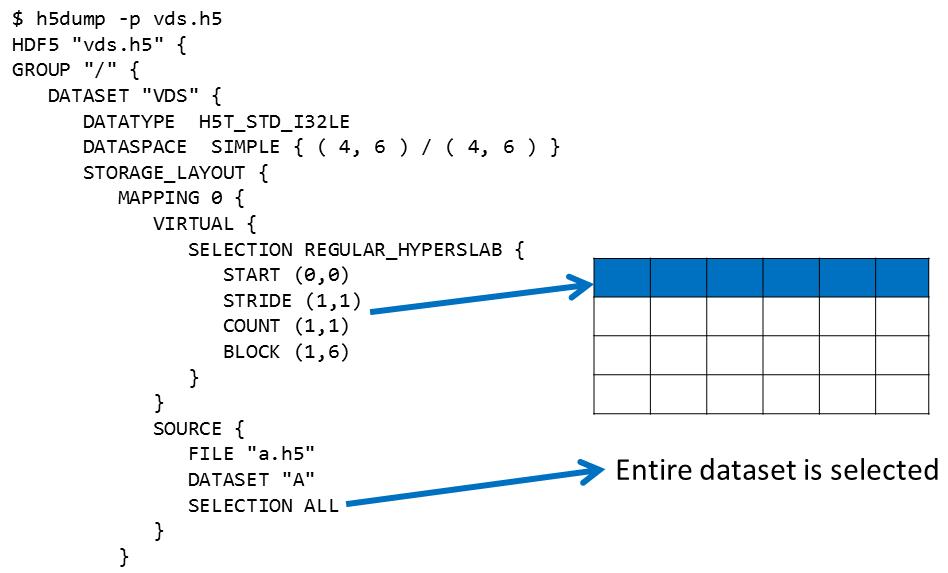

# Introduction to the Virtual Dataset - VDS

The HDF5 Virtual Dataset (VDS) feature enables users to access data in a collection of HDF5 files as a single HDF5 dataset and to use the HDF5 APIs to work with that dataset.

For example, your data may be collected into four files:

{: height=700}

You can map the datasets in the four files into a single VDS that can be accessed just like any other dataset:

{: height=500}

The mapping between a VDS and the HDF5 source datasets is persistent and transparent to an application. If a source file is missing the fill value will be displayed.

See the Virtual (VDS) Documentation for complete details regarding the VDS feature.

The VDS feature was implemented using hyperslab selection (H5S\_SELECT\_HYPERSLAB). See the tutorial on Reading From or Writing to a Subset of a Dataset for more information on selecting hyperslabs.

Programming Model To create a Virtual Dataset you simply follow the HDF5 programming model and add a few additional API calls to map the source code datasets to the VDS.

Following are the steps for creating a Virtual Dataset:

Create the source datasets that will comprise the VDS Create the VDS: ‐ Define a datatype and dataspace (can be unlimited) ‐ Define the dataset creation property list (including fill value) ‐ (Repeat for each source dataset) Map elements from the source dataset to elements of the VDS: Select elements in the source dataset (source selection) Select elements in the virtual dataset (destination selection) Map destination selections to source selections (see Functions for Working with a VDS)

‐ Call H5Dcreate using the properties defined above Access the VDS as a regular HDF5 dataset Close the VDS when finished

Functions for Working with a VDS The H5P\_SET\_VIRTUAL API sets the mapping between virtual and source datasets. This is a dataset creation property list. Using this API will change the layout of the dataset to H5D\_VIRTUAL. As with specifying any dataset creation property list, an instance of the property list is created, modified, passed into the dataset creation call and then closed:

dcpl = H5Pcreate (H5P\_DATASET\_CREATE);

src\_space = H5screate\_simple ... status = H5Sselect\_hyperslab (space, ... status = H5Pset\_virtual (dcpl, space, SRC\_FILE\[i\], SRC\_DATASET\[i\], src\_space);

dset = H5Dcreate2 (file, DATASET, H5T\_NATIVE\_INT, space, H5P\_DEFAULT, dcpl, H5P\_DEFAULT);

status = H5Pclose (dcpl); There are several other APIs introduced with Virtual Datasets, including query functions. For details see the complete list of HDF5 library APIs that support Virtual Datasets

Limitations This feature requires HDF5-1.10. The number of source datasets is unlimited. However, there is a limit on the size of each source dataset.

Programming Examples Example 1 This example creates three HDF5 files, each with a one-dimensional dataset of 6 elements. The datasets in these files are the source datasets that are then used to create a 4 x 6 Virtual Dataset with a fill value of -1. The first three rows of the VDS are mapped to the data from the three source datasets as shown below:

{: height=400}

In this example the three source datasets are mapped to the VDS with this code:

    src\_space = H5Screate\_simple (RANK1, dims, NULL);
    for (i = 0; i < 3; i++) {
        start[0] = (hsize\_t)i;
        /* Select i-th row in the virtual dataset; selection in the source datasets is the same. */
        status = H5Sselect\_hyperslab (space, H5S\_SELECT\_SET, start, NULL, count, block);
        status = H5Pset\_virtual (dcpl, space, SRC\_FILE[i], SRC\_DATASET[i], src\_space);
    }
    

After the VDS is created and closed, it is reopened. The property list is then queried to determine the layout of the dataset and its mappings, and the data in the VDS is read and printed.

This example is in the HDF5 source code and can be obtained from here:

C Example

For details on compiling an HDF5 application: \[ Compiling HDF5 Applications \]

Example 2 This example shows how to use a C-style printf statement for specifying multiple source datasets as one virtual dataset. Only one mapping is required. In other words only one H5P\_SET\_VIRTUAL call is needed to map multiple datasets. It creates a 2-dimensional unlimited VDS. Then it re-opens the file, makes queries, and reads the virtual dataset.

The source datasets are specified as A-0, A-1, A-2, and A-3. These are mapped to the virtual dataset with one call:

    status = H5Pset\_virtual (dcpl, vspace, SRCFILE, "/A-%b", src\_space);
    

The %b indicates that the block count of the selection in the dimension should be used.

C Example

For details on compiling an HDF5 application: \[ Compiling HDF5 Applications \]

Using h5dump with a VDS The h5dump utility can be used to view a VDS. The h5dump output for a VDS looks exactly like that for any other dataset. If h5dump cannot find a source dataset then the fill value will be displayed.

You can determine that a dataset is a VDS by looking at its properties with h5dump -p. It will display each source dataset mapping, beginning with Mapping 0. Below is an excerpt of the output of h5dump -p on the vds.h5 file created in Example 1.You can see that the entire source file a.h5 is mapped to the first row of the /VDS dataset:

{: height=400}
